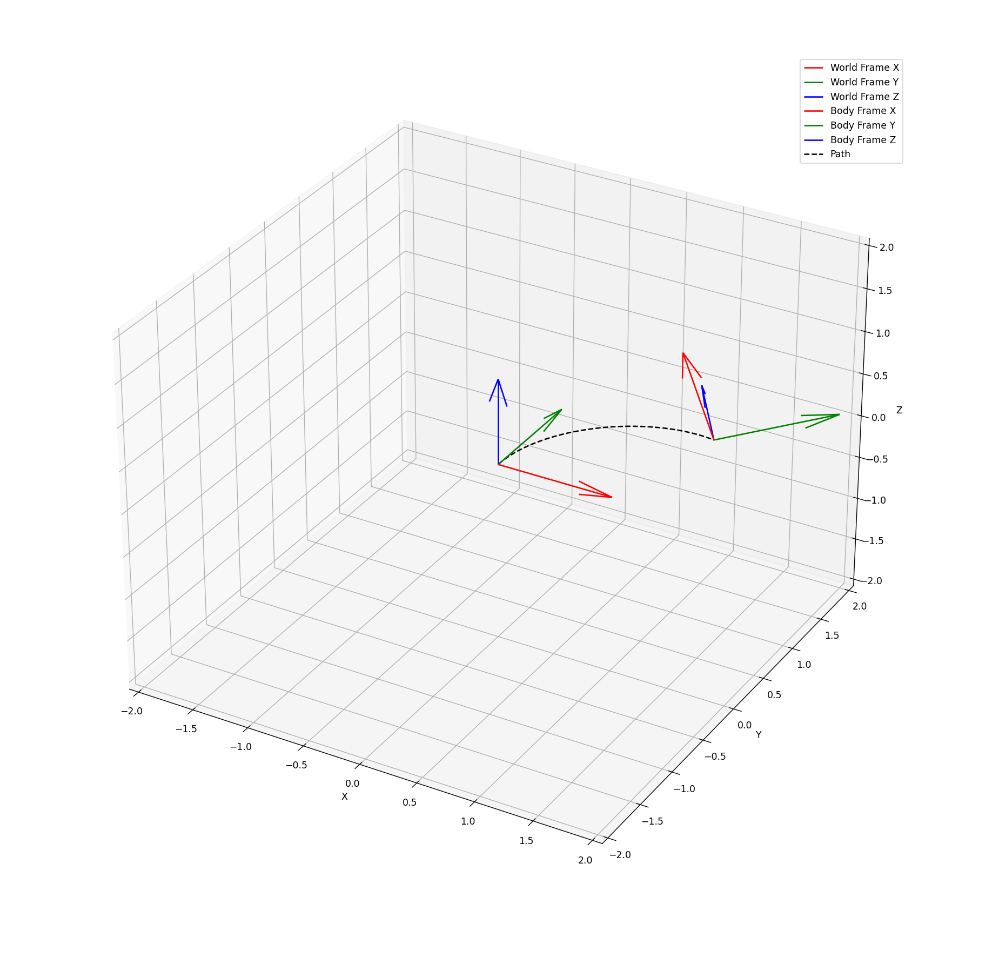

# Euler Rotation Tool

## Overview

The Euler Rotation Tool is a Python-based application designed to visualize and animate the rotation of a body frame relative to a world frame using Euler angles. This tool is particularly useful for understanding the effects of sequential rotations and the resulting orientation of objects in three-dimensional space. It is an educational resource aimed at students and professionals in computer science, mechanical engineering, robotics, and related fields.

## Features

- **Rotation Visualization**: Visualize the rotation of a body frame using Euler angles (phi, theta, psi).
- **Path Tracking**: Track and display the path of the body frame's origin as it moves and rotates.
- **Interactive Animation**: Animate the rotation and translation of the body frame over time.
- **Customizable Trajectories**: Define custom trajectories for translation and rotation.

## Screenshot

 

## Installation

To use the Euler Rotation Tool, you need to have Python and the following libraries installed:

- `numpy`
- `matplotlib`

You can install these dependencies using pip:

```sh
pip install numpy matplotlib
```

## Usage

1. **Clone the Repository**:
   ```sh
   git clone https://github.com/yourusername/euler-rotation-tool.git
   cd euler-rotation-tool
    ```

2. **Run the Application**:
   ```sh
   python euler_rotation_tool.py
   ```

3. **Customize Trajectories**:
   You can customize the translation and rotation trajectories by modifying the trajectory_function in the `euler_rotation_tool.py` file.

## Example
The following example demonstrates how to define a smooth trajectory for the body frame:

```python
def trajectory_function(t):
    dx = 0.01 * np.sin(t)
    dy = 0.01 * np.cos(t)
    dz = 0.01 * t / 10
    dphi = 0.01 * np.sin(t / 2)
    dtheta = 0.01 * np.cos(t / 2)
    dpsi = 0.01 * np.sin(t / 3)
    return dx, dy, dz, dphi, dtheta, dpsi
```

## How It Works

The Euler Rotation Tool uses a combination of translation and rotation matrices to update the position and orientation of the body frame. The rotations are applied in the ZYX order, which means the body frame is first rotated around the Z-axis, then the Y-axis, and finally the X-axis.

### Key Components

- **Frame Class**: Represents a coordinate frame with methods for translation and rotation.
- **plot_frames Function**: Plots the world and body frames along with the path of the body frame's origin.
- **update Function**: Updates the position and orientation of the body frame for each frame of the animation.

## Mathematical Background

The rotation matrices for the ZYX order are defined as follows:

- **Rotation around the Z-axis**:
  
  $$ 
  R_z(\psi) = \begin{bmatrix}
  \cos \psi & -\sin \psi & 0 \\
  \sin \psi & \cos \psi & 0 \\
  0 & 0 & 1
  \end{bmatrix}
  $$

- **Rotation around the Y-axis**:
  
  $$ 
  R_y(\theta) = \begin{bmatrix}
  \cos \theta & 0 & \sin \theta \\
  0 & 1 & 0 \\
  -\sin \theta & 0 & \cos \theta
  \end{bmatrix}
  $$

- **Rotation around the X-axis**:
  
  $$ 
  R_x(\phi) = \begin{bmatrix}
  1 & 0 & 0 \\
  0 & \cos \phi & -\sin \phi \\
  0 & \sin \phi & \cos \phi
  \end{bmatrix}
  $$

The combined rotation matrix $R$ is obtained by multiplying these matrices in the ZYX order:

$$
R = R_z(\psi) R_y(\theta) R_x(\phi)
$$

The translation vector $T$ is defined as:

$$
T = \begin{bmatrix}
dx \\
dy \\
dz
\end{bmatrix}
$$

The new position $P'$ of a point $P$ after rotation and translation is given by:

$$
P' = R \cdot P + T
$$

## Contributing

Contributions are welcome! If you have suggestions for improvements or new features, please open an issue or submit a pull request.

## Contact

For any questions or inquiries, please contact [ronen.g.aniti@gmail.com](mailto:ronen.g.aniti@gmail.com).